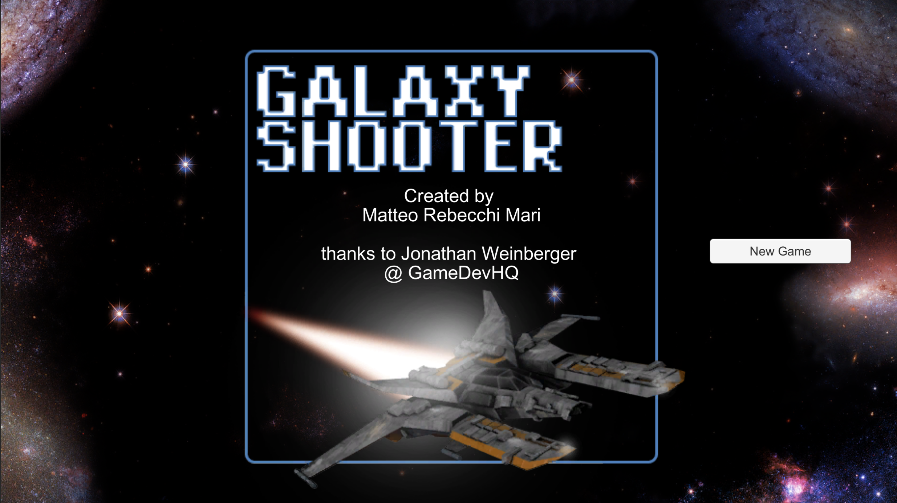
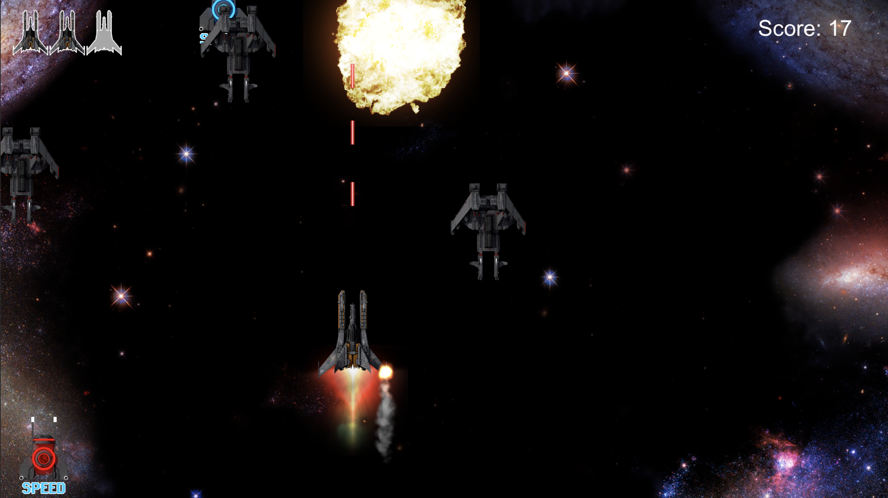

# SpaceShooter
A simple 2d unity project develop during the Udemy course [The Ultimate Guide ro Game Development with Unity 2019](https://www.udemy.com/course/the-ultimate-guide-to-game-development-with-unity/), thanks to [GameDevHQ](https://gamedevhq.com/).

## Screenshots

